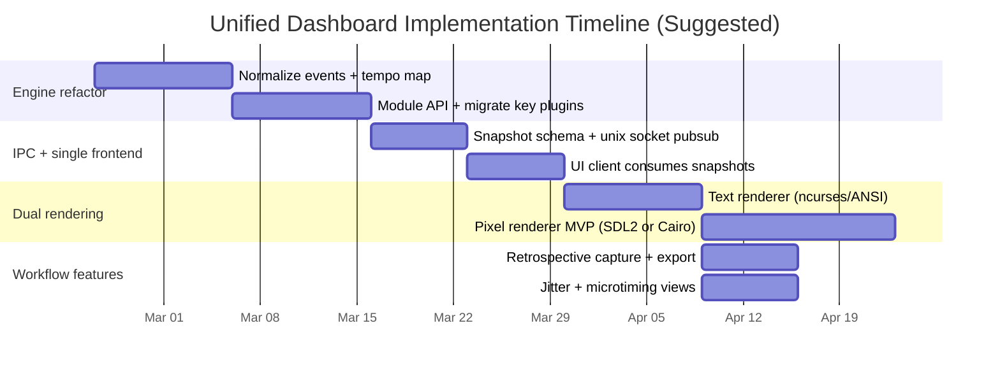

# Unified Raspberry Pi MIDI Dashboard Modernization Report

## Executive summary

Your current **midicrt** codebase is already a strong foundation for a unified dashboard: it has a clean conceptual separation between **MIDI ingest/transport**, **pages**, and **plugins**, plus a pragmatic remote-observability story (shared tmux session) and a centralized JSON configuration policy. In practical terms, you are one refactor away from a “single frontend” that can swap render backends while keeping one shared analysis/core.

The key architectural move I recommend is to split the system into **three layers**:

1) **Real-time core (“engine”)**: low-latency MIDI I/O + event buffer + tempo/clock model + canonical state snapshotting.  
2) **Hot-swappable analysis modules**: harmony/rhythm/pattern/workflow “computations” with clear inputs/outputs and bounded CPU budgets per tick/frame.  
3) **UI shell (“one frontend, two renderers”)**: a single widget/layout model that can render to **text cells** (ncurses/ANSI TUI) or to a **pixel surface** (SDL2 KMSDRM, framebuffer + Cairo, or Qt EGLFS).

For display, **ncurses absolutely runs without X**: it targets terminals (including Linux virtual consoles / TTYs) and therefore does not require any windowing system. An ncurses TUI is the most reliable match for a vintage monochrome CRT and for “full graphics over remote CLI” (ssh + tmux). citeturn1search16

For optional “graphical” mode on the Pi without a desktop, the best contemporary options are:

- **SDL2 on KMSDRM** (good performance, no X/Wayland required; but requires DRM permissions and has Pi-specific wrinkles), citeturn1search1turn1search0turn1search4  
- **Qt EGLFS or Qt LinuxFB** (robust embedded story; EGLFS can be GPU-accelerated; LinuxFB is software-only but simple), citeturn0search3turn0search2  
- **Framebuffer + Cairo** (simple and controllable; excellent for monochrome/low-res, but you own input + damage/refresh), citeturn2search16turn2search15  
- **Web UI served locally** (best for remote “full graphics”; can coexist with a local CRT TUI; lowest friction for remote viewing while keeping the Pi “no desktop”).  

On MIDI/transport: your existing approach—**Mido** with the **RtMidi backend** and ALSA `aconnect` autowiring—is a proven and portable design for Linux. citeturn4search0turn3search1turn3search14 For jitter/clock accuracy, you already compute BPM from MIDI clock tick intervals; I recommend standardizing this into a **tempo map + jitter metrics** module and explicitly reporting RMS jitter and drift (quantiles), with an option to use JACK when you need tighter scheduling/RT privileges. citeturn3search0turn3search3turn3search4turn3search8

Finally, for SysEx: your project uses the “special” manufacturer ID **0x7D** (non-commercial) and the current MIDI Association policy explicitly distinguishes special IDs (including 0x7D) and their intended usage. citeturn0search0turn0search9 I recommend keeping 0x7D for private/local control, and optionally offering a configurable manufacturer ID for a future “public” protocol.

## TODO: Full MIDI Session Recall (Page 16 Memory Sessions)

Goal: complete recall for captured mini-sessions including notes/velocities, CC, and program changes, with deterministic playback/export/import behavior.

### Scope
- Capture and persist all core channel data in session memory:
- `note_on`/`note_off` (including velocity + recovered durations)
- `control_change`
- `program_change`
- (next-tier) pitch bend, channel pressure, aftertouch

### Plan
1. Canonical clip/session schema
- Define one internal clip/session model for page 16 memory sessions:
- ordered event stream (stable ordering for same-tick events)
- note-state map for robust duration closeout
- transport context (`start_tick`, PPQN mapping, tempo/time-signature metadata segment)

2. Capture path upgrade
- Expand experimental memory capture to store full event stream (not just note+CC subsets).
- Keep both structured note spans for rendering and raw/event-level data for exact export.

3. MIDI export/import round-trip
- Export each committed session to `.mid` with tempo + time-signature meta where available.
- Include all captured channel events (notes, CC, program changes, etc.).
- Add import path so saved sessions can be loaded back into page 16 memory browser.

4. Recall UI
- Session browser metadata (length, channels, CC count, program-change count, filename).
- Keep page/session navigation behavior identical for live-captured and imported sessions.

5. Validation
- Round-trip tests: capture -> export -> import -> re-export consistency checks.
- Edge-case tests for overlapping notes, zero-velocity note_on, all-notes-off handling.

## Finished (implemented since this report)

The modernization work outlined in this report has already advanced significantly in the live codebase. The following milestones are now complete.

### 1) Engine foundation and snapshot schema are in place

- Added an `engine/` package with transport/state core (`engine/core.py`), tempo map logic (`engine/state/tempo_map.py`), and snapshot schema composition (`engine/state/schema.py`).
- Added schema v2-style payload support with transport/channel/module data and optional `views` payloads for renderer-facing page data.
- Added capture support in the engine (`capture_recent_to_file`) for retrospective MIDI export workflows.

### 2) IPC snapshot publishing + client path are implemented

- Added Unix-domain socket publishing in `engine/ipc.py` (`SnapshotPublisher`) with client fan-out and rate limiting.
- Added `ui/client.py` (`SnapshotClient`) plus compatibility normalization so clients can consume either direct schema payloads or nested legacy envelopes.
- Core runtime wiring exists in `midicrt.py` via configurable IPC settings (`core.ipc`) and publish frequency controls.

### 3) Renderer abstraction and widget model are active

- Added widget/layout primitives in `ui/model.py` and renderer protocol scaffolding in `ui/renderers/base.py`.
- Added text renderer path (`ui/renderers/text/renderer.py`) and optional pixel renderer path (`ui/renderers/pixel.py`).
- Runtime supports startup profiles (`run_tui`, `run_pixel`, `run_compositor`) while preserving tty-safe defaults and optional pixel dependencies.

### 4) Pixel parity progress and compositor migration landed

- Piano-roll parity milestone delivered (shared widget payload path + pixel rendering parity tests).
- RGB565 compositor migration completed with direct 16-bit framebuffer-oriented drawing in the compositor stack.
- Notes-page visual/compositor enhancements, smooth-motion improvements, and caching/perf throttling changes were implemented.

### 5) Config and operational policies were preserved

- Shared JSON configuration policy remains the source of truth (`config/settings.json`) with expanded sections (e.g., `core`, `capture`, renderer-related settings).
- Startup profile logging and tty1-safe launch policy are preserved; pixel mode remains feature-flagged and optional.
- Existing tmux-first remote co-observation workflow remains intact.

### 6) Validation scaffolding exists for migration-critical paths

- Added/maintained tests for piano-roll snapshot determinism, text/pixel payload parity, and pixel renderer smoke behavior under stubs.

### Remaining work (high level)

The project is now in the “integration hardening” phase rather than initial architecture bring-up. Remaining priorities are:

1. complete page migration to widget-first rendering,
2. further decouple engine internals from page-specific logic,
3. expand contract/IPC/tempo-map test coverage,
4. optionally add a web observer client on top of the existing snapshot stream.

## Current project constraints and architecture from AGENTS.md

### What the codebase already does well

From the repository you provided (`midicrt/`), I see a clear working system with these properties:

- **Runs on tty1 without X**: autologin on tty1, zsh login triggers `/home/billie/run_midicrt.sh`, and the UI is a fullscreen terminal app. (AGENTS.md + README.md)
- **Multi-observer remote access**: a shared `tmux` session (“midicrt”) is the primary mechanism for remote CLI access without degrading the interface. (AGENTS.md + README.md)
- **Central config policy**: all tunables live in a shared JSON (`config/settings.json`), with a config editor page built into the UI. (AGENTS.md)
- **Plugin model**:
  - `handle(msg)` gets per-message events (note on/off, CC, program change; SysEx is routed via a dedicated branch).
  - `draw(state)` gets called every frame with a structured state (tick, bar, running, bpm, cols, rows, y_offset).
  - Some plugins use duck-typed hooks (screensaver active/deactivate, pagecycle notify_keypress). (AGENTS.md)
- **Transport/clock model**: tick counts increment on MIDI clock, bar increments every 24*4 ticks (assumes 4/4), and BPM is computed from recent inter-clock intervals. (midicrt.py)
- **SysEx control plane**:
  - Prefix (0x7D, 0x6D, 0x63) (“mc”) and command byte dispatch.
  - A documented CLI test using `aseqsend` targeting the ALSA sequencer port. (AGENTS.md + README.md)
- **Feature coverage already implemented** (not exhaustive, but important):
  - Harmony/chord+key page, chord/scale detection, tension score, harmonic rhythm, motif detection. (AGENTS.md)
  - Time signature estimation (two plugins). (AGENTS.md)
  - Stuck-note monitoring + panic (All Notes Off) output port. (AGENTS.md + midicrt.py)
  - Piano roll, event log, voice monitor, tuner + audio spectrum.
  - Screensaver to reduce CRT burn-in.

### Constraints that matter for a rewrite

These are the constraints I treat as *load-bearing*, because they are explicitly embedded in the current workflow:

- **TTY-first** launch and reliability: the system is expected to boot into the dashboard on tty1.
- **Remote multi-observation** must remain easy (tmux attach workflow is already correct for that).
- **Shared JSON config** as a project-wide policy (no new per-module config files).
- **SysEx-driven remote control** is already operational and should remain first-class.
- **Real-time responsiveness**: the UI loop targets 60 FPS; MIDI polling loop sleeps 1 ms; transport is updated per clock tick.

### Assumptions I am making (explicit)

Because AGENTS.md is focused on operational notes rather than hardware specifics, I am assuming the following:

- I assume you are running a Debian-family OS (likely Raspberry Pi OS / Debian), because the launch approach uses systemd + getty overrides + ALSA utilities (`aconnect`, `aseqsend`) that are typical in that environment. citeturn3search14turn3search7  
- I assume your “green monitor” is receiving a signal that the Pi renders as a normal framebuffer/console output (HDMI→converter or composite), meaning the Pi is producing a color image that the monitor displays in monochrome green. (This affects palette decisions, contrast, and burn-in risk.)
- I assume the Pi is in the Pi-3-to-Pi-5 class where KMSDRM/DRM is available; however, I treat “pure terminal/TTY” as the universal fallback.

## Can ncurses run without X

Yes—**ncurses does not require X**.

ncurses is a curses-compatible library designed to build **textual user interfaces** on “terminals” using terminfo and terminal control sequences. In practice this includes:

- Linux virtual consoles (*tty1*, etc.)  
- serial terminals  
- terminal emulators under X/Wayland  
- remote terminals via SSH  

The key point: ncurses targets the **terminal abstraction**, not a windowing system. This is why ncurses UIs regularly run on Linux systems regardless of whether X is installed or running. citeturn1search16

### Framebuffer/TTY usage and what it means for a monochrome CRT

- A Linux **virtual console** is typically drawn by the kernel console subsystem (historically fbcon on fbdev, increasingly DRM/KMS console in modern setups). Either way, from the app’s perspective, it writes text control sequences; the console driver renders glyphs to the screen.  
- For a monochrome CRT, the main “limitations” are not ncurses-specific—they are *display physics* and console font constraints:
  - Thin glyphs can bloom/blur; prefer larger fonts / fewer columns if you can.
  - Avoid full-screen high-contrast static content (burn-in). Your existing screensaver plugin is exactly the correct mitigation.
  - Color is effectively reduced to brightness/contrast; rely on **reverse video**, **bold**, and **simple box-drawing** rather than subtle color schemes. (ncurses supports attributes even when colors aren’t useful.)

Pragmatically: if your current blessed-based TUI works on tty1 today, an ncurses version will also work there.

## UI rendering options for a Pi that has a monitor but no desktop requirement

You asked for concrete headless-style options; I interpret “headless” here as **“no X/Wayland desktop required,”** while still driving a physical monitor and supporting remote access.

### Rendering option matrix

| Option | What it is | Runs without X/Wayland | Typical performance | Monochrome/green suitability | Remote “full graphics” story | Notes / risks |
|---|---|---:|---|---|---|---|
| **Terminal TUI (ncurses / ANSI / blessed)** | Draw to terminal cells | Yes | Excellent (very light) | Excellent (attributes map well) | Excellent via SSH/tmux | ncurses is designed for this use case citeturn1search16 |
| **Linux console + ANSI (your current approach)** | Similar to TUI above | Yes | Excellent | Excellent | Excellent via tmux | Already works; biggest gains are architectural modularity rather than display changes |
| **Raw framebuffer (fbdev) drawing** | Write pixels to `/dev/fb0` | Yes (when fbdev exists) | Good if carefully optimized; CPU-bound | Excellent (you control palette) | Remote requires streaming/VNC-like solution | fbdev is a kernel subsystem for display memory access, but modern systems trend toward DRM/KMS citeturn1search9turn0search2 |
| **Framebuffer + Cairo** | Use Cairo to render to mapped fb buffer | Yes | Moderate (software render) | Excellent (easy grayscale/1-bit style) | Remote requires separate transport | Cairo is a general 2D library; framebuffer examples exist in embedded docs citeturn2search16turn2search15 |
| **SDL2 on KMSDRM** | SDL2 opens a DRM/KMS fullscreen surface | Yes | Very good; can be low-latency | Good (you choose colors; can do green theme) | Remote via separate strategy (web/stream) | SDL2 supports KMSDRM and has knobs around DRM master + double buffering citeturn1search1turn1search0turn1search4 |
| **SDL2 on fbcon (legacy path)** | SDL uses framebuffer console driver | Sometimes (depends on build/drivers) | Varies; can be fragile | Good | Remote via separate strategy | SDL docs list fbcon/directfb historically; but availability depends on SDL build and platform citeturn1search1turn1search2 |
| **DirectFB** | Older embedded graphics stack | Yes (in theory) | Historically good; today uncertain | Could be good | Remote via separate strategy | DirectFB is effectively unmaintained in major distros; Debian has moved to remove it citeturn2search1 |
| **Qt EGLFS** | Qt fullscreen OpenGL/EGL without window system | Yes | Very good (GPU) | Good (theme controls) | Remote via separate strategy | Qt docs explicitly describe EGLFS as “no X11/Wayland” embedded mode citeturn0search3turn0search2 |
| **Qt LinuxFB** | Qt draws directly to framebuffer (software) | Yes | Moderate, software; vsync possible via DRM dumb buffers | Good | Remote via separate strategy | Qt recognizes fbdev deprecation and offers DRM dumb buffer mode citeturn0search2 |
| **GTK/Qt via framebuffer** | “Toolkit without desktop” | Qt: Yes; GTK: realistically no | Qt: workable; GTK: not recommended | Qt: good | Remote via separate strategy | GTK removed/doesn’t maintain DirectFB; modern GTK focuses on Wayland citeturn2search9turn2search1 |
| **Web UI served locally** | Local HTTP + browser client UI | Yes (server) | Good (depends on browser) | Mixed: depends on browser availability on Pi | Excellent: remote browser shows full UI | Best answer for “remote full graphics” while keeping local CRT TUI |
| **LVGL on Linux fbdev** | Embedded GUI library on framebuffer | Yes | Good; designed for embedded | Excellent (embedded themes, simple graphics, low-res friendly) | Remote via separate strategy | LVGL documents fbdev driver usage directly citeturn1search9 |

### Recommendations for your particular constraints

- If “vintage green CRT + remote CLI with full graphics” remains central, **a TUI is the primary UI**. It is inherently remote-friendly (tmux attach) and naturally matches the CRT.
- If you want a **graphical mode** primarily for (a) richer plots or (b) a “local kiosk” view, the best practical choices in 2026 are:
  - **SDL2 on KMSDRM** (lighter than Qt, more immediate control). citeturn1search1turn1search0turn1search4  
  - **Qt EGLFS** if you want a full widget toolkit and are okay with heavier dependencies. citeturn0search3turn0search2  
  - **Framebuffer + Cairo** if you want maximal determinism and a pure software pipeline that you can tune for monochrome legibility. citeturn2search16turn2search15  
  - **Web UI** for remote full graphics while leaving the CRT in text-mode.  

## Feature-to-implementation mapping with libraries and Pi feasibility

You asked to map high-priority features across harmony/rhythm/pattern/workflow utilities to inputs, libraries, and CPU cost. I treat “high priority” here as: features that either (a) are already partially implemented and should be standardized, or (b) unlock large workflow value (capture, confidence reporting, timing insight).

### Core input signals to normalize

I recommend normalizing the MIDI ingest into an internal event type with these fields:

- `t_wall` (monotonic timestamp)  
- `t_beat` (beat position, derived from MIDI clock/tempo map; if unavailable, `None`)  
- `type`: note_on, note_off, cc, program, sysex, start/stop/continue/clock  
- `ch`, `note`, `vel`, `cc`, `value`, `sysex_bytes` as applicable  

For MIDI clock: the MIDI Association notes the clock message is `F8` sent 24 times per quarter note; you can therefore define beat position precisely in terms of pulses and measure jitter via inter-arrival times. citeturn3search12

### Library roles in this architecture (what to use them for)

- entity["organization","Mido","python midi objects lib"]: robust MIDI message/port abstraction; supports RtMidi backends and MIDI file writing; also supports reading/writing SYX. citeturn4search0turn4search13  
- entity["organization","RtMidi","c++ realtime midi api"] / entity["organization","python-rtmidi","python rtmidi bindings"]: real-time I/O across ALSA/JACK on Linux; this is effectively what you use via Mido’s RtMidi backend today. citeturn3search1turn3search20  
- entity["organization","music21","python music analysis lib"]: heavyweight symbolic theory tooling (Roman numeral from chord+key; key analysis with correlation coefficients and alternate interpretations). citeturn4search6turn5search9  
- entity["organization","partitura","python symbolic music lib"]: symbolic feature extraction oriented toward “note arrays,” with functions for time estimation and tonal tension that can work from structured arrays. citeturn5search7turn5search6  
- entity["organization","pretty_midi","python midi feature lib"] + entity["organization","miditoolkit","python midi toolkit"]: file/clip-oriented representations that are very useful once you add retrospective capture; great for offline computations or “commit” operations. citeturn4search8turn0search21  
- entity["organization","mididings","python midi router"] and entity["organization","Midish","cli midi sequencer filter"]: not required inside your code, but strong candidates for reuse/inspiration (routing/scenes, capture/quantize). citeturn5search5turn5search1turn5search14  

### Feature mapping table

Resource-cost is **relative** and assumes typical Pi-class hardware; “real-time feasible” means “can run continuously without UI hitches if written incrementally.”

| Feature group | Feature | Inputs required | Implementation approach | Suggested libraries | Pi cost | Real-time feasible |
|---|---|---|---|---|---|---|
| Harmony | Chord candidates + confidence + missing tones (you already have) | note_on/off (+ optional channel) | Maintain active pitch classes + recent chord window; match to chord dictionary; compute coverage ratio | (existing) + optional music21 for offline validation | Low | Yes |
| Harmony | Key estimate with top-N alternatives + correlation | note events over window | Rolling pitch-class histogram; output top-N keys + confidence; optionally use music21_key analysis for alternateInterpretations and correlationCoefficient | music21 supports correlationCoefficient + alternateInterpretations citeturn5search9turn5search4 | Med (music21), Low (custom) | Custom: yes; music21: “maybe” (windowed/offline) |
| Harmony | Roman numeral/function labeling | chord + key hypothesis | Only after key stabilized; map chord degrees to Roman numeral; display ambiguity | music21 romanNumeralFromChord citeturn4search6turn4search14 | Med–High | Yes if throttled (only on chord changes) |
| Harmony | Tonal tension ribbons | notes + beat positions + spelling + key | Compute tension features over chord onsets; partitura can estimate pitch spelling & key if missing | partitura estimate_tonaltension (requires spelling/key, can estimate) citeturn5search6turn5search10 | Med | Yes if computed sparsely (on chord-change/onset) |
| Rhythm | BPM from MIDI clock (already) | MIDI clock + start/stop | Standardize into tempo map; compute robust average and drift | MIDI clock 24 ppqn spec citeturn3search12 | Low | Yes |
| Rhythm | Clock jitter monitor (RMS/percentiles) | clock timestamps | Track inter-clock deltas; compute RMS, p95, max; show warnings | (custom) | Low | Yes |
| Rhythm | Microtiming lead/lag against beat grid | note_on timestamps + tempo map | Compute note_on offset from nearest gridline; histogram by subdivision | (custom) | Low–Med | Yes |
| Rhythm | Time signature estimation | note onsets; beat structure | Combine your current heuristics with explicit priors; expose confidence + stability | (existing) + optional partitura estimate_time (tempo/meter/beats) citeturn5search7 | Med | Yes |
| Pattern | Motif detection (you already have interval n-gram) | note_on stream | Maintain interval history; match windows; expose counts | (existing) | Low | Yes |
| Pattern | Retrospective capture last N bars | event buffer + tempo map | Ring buffer keyed by beat time; “commit” to MIDI file when triggered | Mido MidiFile writing citeturn4search13turn4search0 | Low–Med | Yes |
| Pattern | Similarity search in-session | captured clips | Compute hashes (interval, rhythm, PCP) per clip; nearest-neighbor search | pretty_midi/miditoolkit for clip manipulations citeturn4search8turn0search21 | Med | Not continuous; feasible on-demand |
| Workflow | “Panic” out + stuck note watchdog (already) | note on/off + output port | Track unmatched note-ons; send CC123/all-notes-off (or per-note offs) on threshold | (existing) + ALSA port wiring via aconnect citeturn3search14 | Low | Yes |
| Workflow | SysEx remote commands (already) | sysex bytes | Keep your prefix+command dispatch; add versioning + schema | MIDI 0x7D special ID policy context citeturn0search0turn0search9 | Low | Yes |
| Workflow | Remote “full graphics” mode | none (UI concern) | Serve web UI; or stream framebuffer; or run separate TUI attach | (custom) | Med | Yes if decoupled |

## Proposed unified software architecture

### Architectural goals

1) Preserve what is best about current midicrt: **TTY-first, low-latency, remote attach via tmux**, minimal moving parts.
2) Support a single “frontend” that can render to either:
   - **Text cells** (ncurses/ANSI) for CRT + SSH/tmux
   - **Pixels** (SDL2/Qt/Cairo) for optional richer graphics
3) Make analysis modules **hot-swappable**: add/remove computations without changing ingest or renderer.

### Proposed component model

- **Engine process (`midicrt-engine`)**
  - Owns MIDI I/O (RtMidi/ALSA/JACK).
  - Maintains the canonical event buffer + tempo map.
  - Runs analysis modules on a schedule.
  - Publishes state snapshots over an IPC channel.

- **Frontend process (`midicrt-ui`)**
  - Subscribes to state snapshots.
  - Runs an input handler (keyboard + optionally mouse).
  - Renders via a “renderer backend”:
    - `TextRenderer` (ncurses/ANSI)
    - `PixelRenderer` (SDL2 KMSDRM OR FB+Cairo OR Qt EGLFS)

This split is what enables:
- running the CRT UI locally, and
- simultaneously running a remote UI client (TUI attach or web).

### IPC options (practical on a Pi)

- **Unix domain socket + msgpack/json**: simplest, robust.
- **Shared memory + ring buffer**: highest performance, but more complexity.
- **ZeroMQ / nanomsg**: convenient pub-sub, but adds dependency.

Given your existing simplicity ethos, I recommend **Unix domain sockets** for the first iteration.

### Data model: event buffer, tempo map, analysis cache

- **Event buffer**
  - ring buffer of last N seconds/bars of normalized events;
  - indexes by wall-clock time and beat time (if clock present).

- **Tempo map**
  - derived from MIDI clock tick deltas;
  - stores rolling BPM, jitter, and derived beat time (`t_beat`) mapping.

- **Analysis cache**
  - `harmony`: chord candidates, key hypotheses, roman numeral, tension
  - `rhythm`: bpm, meter hypothesis, microtiming histograms
  - `pattern`: motif candidates, loop/capture slots
  - `workflow`: stuck notes, warnings, last SysEx cmd, connection status

### Mermaid: high-level architecture

```mermaid
flowchart LR
  MIDIIN[MIDI In\n(ALSA/JACK/RtMidi)] --> ENG[Engine\nEvent buffer + tempo map]
  ENG --> ANA[Analysis modules\n(harmony/rhythm/pattern/workflow)]
  ANA --> SNAP[State snapshot\n(immutable view)]
  SNAP --> IPC[IPC Pub/Sub\nUnix socket]
  IPC --> TUI[TUI Frontend\nncurses/ANSI]
  IPC --> GUI[Pixel Frontend\nSDL2 KMSDRM / FB+Cairo / Qt EGLFS]
  IPC --> WEB[Web UI\n(local HTTP + WS)]
  TUI --> MON1[Local CRT (tty)]
  TUI --> REM1[SSH/tmux attach]
  GUI --> MON2[Local monitor pixels]
  WEB --> REM2[Remote browser]
```

### Hot-swappable modules: recommended interface

A module should look like:

- `on_event(event)` — fast; may enqueue work but must not block.
- `on_tick(now, tempo_state)` — periodic; bounded time budget.
- `get_state()` — returns a small immutable dict for snapshot merging.

This resembles your existing plugin scheme (`handle` + `draw`) but separates **analysis from rendering** so renderers never “own” analysis logic.

## Implementation plan, deliverable zip layout, and repo adaptation targets

### Prioritized plan (incremental, low-risk)

I am intentionally ordering this so you get a working system early and do not regress the CRT workflow.

**Phase 1 — Stabilize the engine boundary (keep current UI working)**
- Extract MIDI ingest + tempo map + analysis modules into an “engine” that can still be called in-process by the current UI loop.
- Convert existing plugins/pages into either:
  - analysis modules (pure computation), or
  - UI widgets (pure presentation).

**Phase 2 — Add IPC snapshot publishing**
- Run engine as a distinct process; keep current UI as a client.
- Preserve tmux attach workflow.

**Phase 3 — Introduce a renderer abstraction**
- Implement `TextRenderer` (ncurses or keep ANSI initially).
- Implement a **minimal** pixel renderer (SDL2 KMSDRM *or* framebuffer + Cairo).
- Ensure both renderers draw the same widget tree.

**Phase 4 — Add web UI (optional but high value)**
- Serve the same snapshot state for rich remote view.

### Mermaid: timeline/Gantt (illustrative)



### Proposed deliverable `.zip` contents (source tree layout)

| Path | Purpose |
|---|---|
| `README.md` | Build/run instructions (TTY mode + pixel mode + remote) |
| `AGENTS.md` | Updated operational notes (boot launch, tmux, config policy) |
| `pyproject.toml` / `requirements.txt` | Python deps pinned; optional extras for pixel/web |
| `scripts/` | `run_tui.sh`, `run_gui.sh`, `run_engine.sh`, `install_service.sh` |
| `config/settings.json` | Central config (same policy as now) |
| `engine/` | MIDI I/O, event normalization, tempo map, snapshot publisher |
| `engine/io/` | ALSA/JACK/RtMidi adapters; autoconnect helpers |
| `engine/state/` | event buffer, tempo map, analysis cache |
| `engine/modules/` | harmony.py, rhythm.py, pattern.py, workflow.py |
| `ui/` | shared widget/layout model + rendering targets |
| `ui/renderers/text/` | ncurses/ANSI renderer |
| `ui/renderers/pixel/` | SDL2 KMSDRM renderer OR framebuffer+Cairo renderer |
| `ui/app.py` | frontend main; keybindings; page/widget composition |
| `web/` (optional) | local server + websocket streaming of snapshots |
| `tests/` | unit tests (analysis), replay tests (MIDI logs), perf tests |
| `tools/` | MIDI replay tool, snapshot recorder, jitter benchmark |

This layout is designed so the “engine” can be exercised without any UI (important for testing and performance work) and so multiple UIs can subscribe without changing analysis code.

### Open-source projects/prototypes to adapt (with links)

Because you requested explicit repo URLs, I’m listing them in a code block.

```text
Mido (Python MIDI I/O + files)
https://github.com/mido/mido

RtMidi (C++ realtime MIDI I/O across ALSA/JACK)
https://github.com/thestk/rtmidi

python-rtmidi (Cython bindings to RtMidi)
https://github.com/SpotlightKid/python-rtmidi

mididings (MIDI routing/processing “scenes”; OSC/DBUS hooks; inspiration for routing layer)
https://github.com/mididings/mididings

midish (CLI sequencer/filter; quantize, record, sync, SysEx; inspiration for capture/loop tools)
https://github.com/ratchov/midish

pretty_midi (MIDI clip/object model; good for offline feature extraction after capture)
https://github.com/craffel/pretty-midi

partitura (symbolic note arrays; time/key/tension estimation tools)
https://github.com/CPJKU/partitura

SDL2 Wiki docs (KMSDRM hints, backends)
https://wiki.libsdl.org/

LVGL (embedded GUI; fbdev driver docs are strong if you want a “real GUI” without desktop)
https://github.com/lvgl/lvgl
```

Notes on what to reuse:

- Mido + RtMidi: keep as your default path; it already works well in your codebase. citeturn4search0turn3search1  
- mididings: reuse ideas for “scenes/patches” and external command hooks; it explicitly targets ALSA/JACK and supports event monitoring + external command execution. citeturn5search5turn5search8  
- midish: reuse concepts for “capture/record/quantize/sync” workflows; it is deliberately designed for real-time CLI sequencing with sync and SysEx. citeturn5search1turn5search16turn5search14  
- Qt EGLFS/LinuxFB: reuse their proven embedded patterns if you choose Qt for pixel mode. citeturn0search3turn0search2  
- SDL2: reuse KMSDRM driver support and low-latency options like double buffering hints. citeturn1search4turn1search0  
- LVGL: if you want a “GUI toolkit feel” without a desktop, LVGL’s fbdev integration is explicitly documented. citeturn1search9  

## Minimal proof-of-concept plan

You asked for *three* features to implement first, with pseudocode and mockups. I’m choosing the three that create a platform for everything else:

1) **Engine + snapshot contract** (enables unified frontend and multiple renderers)  
2) **Clock jitter + microtiming metrics** (high musical utility, low CPU, leverages MIDI clock spec) citeturn3search12  
3) **Retrospective capture “last N bars → MIDI file”** (immediate composition workflow value; uses Mido’s MIDI file support) citeturn4search13turn4search0  

### Pseudocode: normalized event ingest + tempo map + snapshot

```python
# engine/core.py (conceptual)

class TempoMap:
    def __init__(self):
        self.running = False
        self.ppqn = 24
        self.last_clock_t = None
        self.intervals = RingBuffer(maxlen=96)  # 4 beats
        self.bpm = 0.0
        self.jitter_rms_ms = 0.0
        self.tick = 0
        self.bar = 0
        self.beats_per_bar = 4  # default; can become estimated

    def on_start(self):
        self.running = True
        self.tick = self.bar = 0
        self.last_clock_t = None
        self.intervals.clear()

    def on_stop(self):
        self.running = False

    def on_clock(self, t_now):
        if not self.running:
            return
        self.tick += 1
        if self.tick % (self.ppqn * self.beats_per_bar) == 0:
            self.bar += 1

        if self.last_clock_t is not None:
            dt = t_now - self.last_clock_t
            self.intervals.append(dt)

            # Robust BPM estimate
            avg = mean(self.intervals)
            self.bpm = 60.0 / (self.ppqn * avg)

            # Jitter (RMS of deviation from avg)
            self.jitter_rms_ms = 1000.0 * sqrt(mean([(x-avg)**2 for x in self.intervals]))

        self.last_clock_t = t_now


class Engine:
    def __init__(self, io, modules):
        self.io = io
        self.tempo = TempoMap()
        self.events = EventRing(seconds=120)         # last 2 minutes
        self.modules = modules
        self.snapshot = {}

    def on_midi(self, msg):
        t = monotonic_time()
        ev = normalize(msg, t, self.tempo)
        self.events.push(ev)

        # Keep tempo map tightly updated
        if msg.type == "start": self.tempo.on_start()
        elif msg.type == "stop": self.tempo.on_stop()
        elif msg.type == "clock": self.tempo.on_clock(t)

        for m in self.modules:
            m.on_event(ev)

    def tick(self):
        # periodic module work with a time budget
        for m in self.modules:
            m.on_tick(monotonic_time(), self.tempo)

        self.snapshot = build_snapshot(self.tempo, self.modules, self.events)
        publish_snapshot(self.snapshot)
```

### Text-mode mockup (ASCII)

```text
[RUN ]  124.8 BPM  BAR 0031  ●   jitter RMS 0.9ms  p95 1.6ms
Chord:  Dm9   (conf 0.87; missing: F)    Key: C maj (0.62) | d min (0.54)
Tension: ███████░░░░░░░░░░░░  3.8  mild   [M2/m7]
Motif:  +4 -2  [x3]    Harm.rhy: 2.0 ch/bar  fast

Capture buffer: 120s  | last 8 bars ready ✅  | press ^C to write take_07.mid
Warnings: none
```

### Pixel-mode “small bitmap” mockup suggestion (conceptual)

I’m describing this as a “bitmap layout” rather than pasting an actual image:

- Resolution target: **640×480** (typical friendly CRT timing).  
- Color theme: **single-channel green** with 2–4 intensity levels (black, dim green, green, bright green).  
- Font: one mono bitmap font (e.g., 8×16 or 12×24) to emulate terminal legibility.

Layout rectangles:

- Top strip: 640×40 — transport + jitter
- Next strip: 640×60 — chord/key/tension
- Main panel: 640×320 — piano roll or histograms
- Bottom strip: 640×60 — capture status + warnings

If using SDL2, you can render this with a fixed glyph atlas and a very small drawing API; SDL2 explicitly supports KMSDRM and provides hints around DRM master and buffering/latency. citeturn1search0turn1search4turn1search1

## SysEx handling, MIDI clock accuracy/jitter, and low-latency I/O strategies

### SysEx handling and manufacturer ID policy

Your current SysEx format uses `F0 7D 6D 63 <cmd> ... F7` and treats `0x7D` as a private/non-commercial manufacturer ID. That is consistent with longstanding documentation that 0x7D is “educational/development use” and should not appear in commercial designs. citeturn0search9turn0search0

Recommendation:
- Keep `0x7D` for private control in your own rig.
- Add a config option to choose:
  - 0x7D (private/dev),
  - a purchased manufacturer ID (if you ever publish the protocol),
  - and **versioning** inside the payload (e.g., one byte `proto_ver` right after `mc`).

Also: ALSA tooling (`aseqsend`) explicitly supports sending SysEx to ALSA sequencer ports; this matches your existing testing workflow. citeturn3search7turn3search16

### MIDI clock accuracy and jitter measurement

Because MIDI clock is specified as a single-byte `F8` sent **24 times per quarter note**, you can compute tempo and jitter precisely from inter-arrival times. citeturn3search12

Recommendations:
- Compute jitter as:
  - RMS of (dt - mean_dt)
  - percentile bands (p50/p90/p99)
  - “dropouts” (dt > threshold)
- Provide two jitter views:
  1) short-window (last 1–2 beats) for “is it wobbling now?”
  2) long-window (last ~30–60s) for “is sync stable?”

### Low-latency MIDI I/O on Pi: ALSA, JACK, RtMidi

- **RtMidi** provides a cross-platform API for real-time MIDI I/O, including ALSA and JACK on Linux, but it is not itself a scheduler—it timestamps input and sends output immediately. citeturn3search1  
- **JACK** is explicitly designed for real-time, low-latency routing of audio and MIDI between apps. Its documentation emphasizes that realtime scheduling is available on standard Linux kernels and that an RT kernel is only needed for very low-latency edge cases. citeturn3search4turn3search0turn3search3  

Practical strategy:
- Default: **ALSA sequencer via Mido/RtMidi** (what you do today).
- Optional “tight mode”: run under JACK when you need consistent scheduling and are already in a JACK-based environment (common in synth rigs).
- Ensure your process has appropriate scheduling privileges when needed; JACK’s docs explain the RT scheduling config concerns. citeturn3search3  

## Testing and validation strategy

### Unit tests (fast, deterministic)

- **Harmony tests**
  - Feed known pitch sets into chord matcher; assert candidates and confidence math.
  - Assert key estimator outputs top-N stable on canonical examples.
- **Tempo/jitter tests**
  - Simulate clock ticks at ideal intervals; jitter should be ~0.
  - Inject jitter distributions; validate RMS/percentiles.
- **SysEx tests**
  - Feed byte sequences; assert correct command dispatch and bounds checking.

### Performance tests (Pi-realistic)

- **Message-rate stress**
  - Replay captured MIDI logs at 1× and 4× speed; ensure no dropped UI frames.
- **CPU budget enforcement**
  - Each analysis module gets a time budget per tick; run watchdog that logs overruns.

### Real-device tests (what matters in your rig)

- **Port discovery/autoconnect**
  - Validate `aconnect` heuristics across reboots and different USB enumeration orders; `aconnect` is the canonical tool for connecting ALSA sequencer ports. citeturn3search14  
- **Clock stability**
  - Compare jitter metrics against known-good clock sources; verify warnings match audible drift.
- **CRT-specific**
  - Burn-in prevention: confirm screensaver triggers and wakes correctly under both keypress and MIDI activity (you already do this; keep it as a regression test).

### “Golden snapshot” approach

Once IPC snapshots exist:
- record snapshots for a scripted MIDI performance;
- compare expected vs observed snapshot sequences (stable regression harness).

This is particularly useful for your “single frontend with two renderers” goal: the renderers can be tested against the same snapshot stream.
